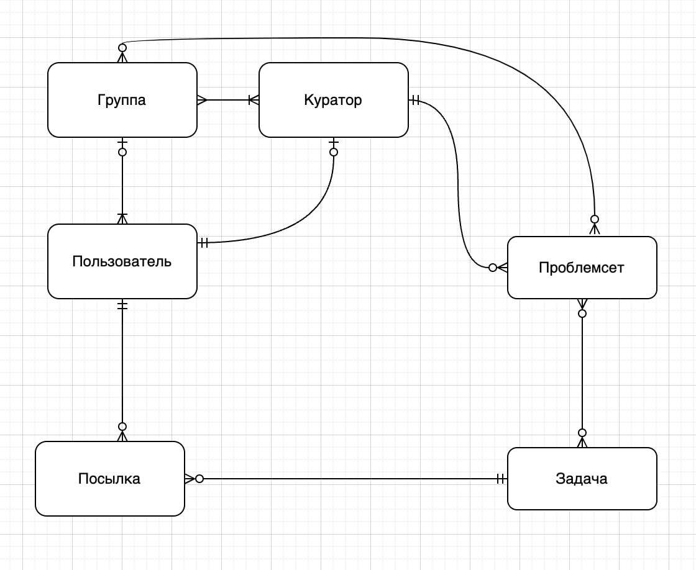

Тема проекта: "Мониторинг решения задач по программированию с внешних платформ", в качестве внешней платформы предлагаю пока что рассматривать только один сайт: codeforces.com 

Короткое описание: мониторинг может использоваться различными онлайн-школами/кружками для координации и наблюдения за прогрессом студентов. Кураторы назначаются администраторами сайта, куратор может собрать группу из пользователей, собирать проблемсеты (контесты) для них из существующих на codeforces.com задач. По посылкам студентов собирается статистика и формируются таблицы с результатами.

Описание сущностей:
1) Пользователь
2) Куратор (= привилегированный пользователь)
3) Группа (у каждой группы должен быть хотя бы 1 куратор, группа состоит из пользователей, каждой группе предлагается решать некоторый набор проблемсетов)
4) Проблемсет (проблемсеты состоят из задач, у каждого проблемсета есть автор среди кураторов)
5)  Задача
6) Посылка (попытка решения задачи пользователем, попытки строго привязаны к пользователям и к определенной задаче)

