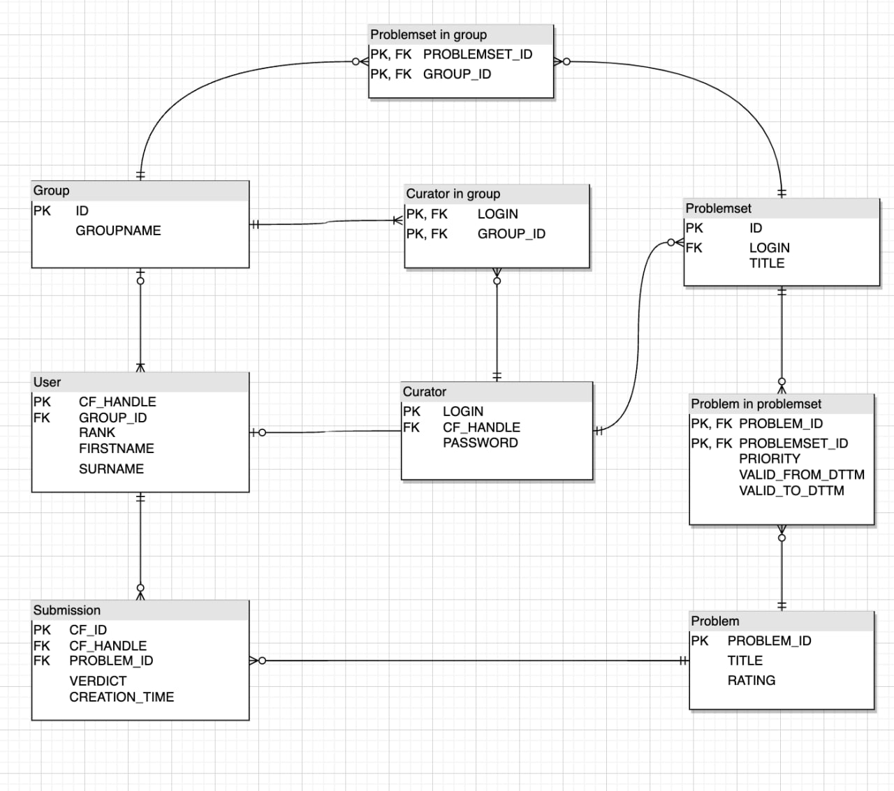

Логическая и физическую модель проекта.  
Модель находится в 2й нормальной форме, так как нет сложных составных PK.

Логическая модель:

Физическую модель можно найти в файле Физическая модель БД.pdf